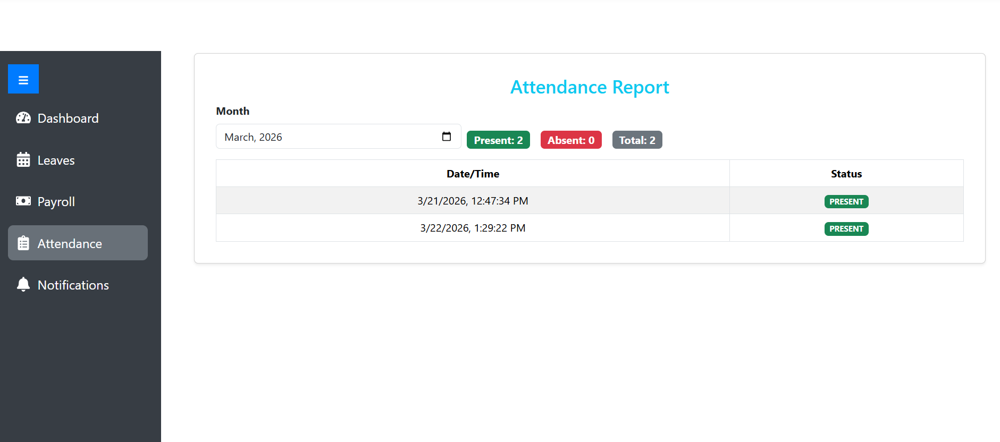
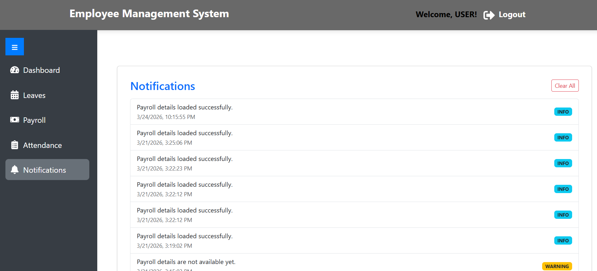

# 🏢 Employee Management System

<div align="center">


[](https://employee-management-system-inky-ten.vercel.app/)
[](https://employee-management-system-production-8fdb.up.railway.app)
[](LICENSE)

**A production-grade, full-stack HR platform with role-based access control, JWT authentication, and real-time workflow management.**

[Live Demo](https://employee-management-system-inky-ten.vercel.app/) • [Backend API](https://employee-management-system-production-8fdb.up.railway.app) • [Report Bug](https://github.com/Sanchit1224/Employee-management-System/issues)

</div>

---

## 🌐 Live Demo

| Service | URL | Status |
|---|---|---|
| Frontend (Vercel) | https://employee-management-system-inky-ten.vercel.app/ |  |
| Backend API (Railway) | https://employee-management-system-production-8fdb.up.railway.app |  |

> ⚠️ **Note:** Backend is hosted on Railway free tier — please allow **30 seconds** for cold start on first request.

### Demo Credentials

| Role | Username | Password |
|---|---|---|
| Admin | `admin` | `admin123` |
| Manager | `manager` | `manager123` |
| User | `user` | `user123` |

---

## 🏗️ Architecture

```
Browser
  │
  ▼
React (Vite) ──── Vercel CDN
  │  (JWT Bearer Token in every request)
  ▼
Spring Boot 3.x ── Railway Cloud
  │  (JWT Auth · Spring Security · RBAC)
  ▼
MySQL 8.0 ──────── Railway Managed DB
```

```
React (Vite) → Spring Boot (JWT/RBAC) → MySQL
     ↓                  ↓
  Vercel CDN       Railway Cloud
```

---

## ✨ Features

### 👤 User Panel
- Mark daily attendance (Present / Absent)
- Apply for leave with reason and date range
- Track leave request status (Pending / Approved / Denied)
- View payroll details (salary, deductions, net pay)
- Receive in-app notifications

### 👨‍💼 Manager Panel
- Monitor team members and their attendance
- Review and manage employee leave requests
- Add and manage new employees under their team
- View department-level reports

### 🛠️ Admin Panel
- Approve or deny all leave requests across the organisation
- Full CRUD operations on employee records
- Manage and update payroll for all employees
- Complete system control and audit visibility

---

## 🛠️ Tech Stack

### Frontend
| Technology | Purpose |
|---|---|
| React.js (Vite) | UI framework |
| Axios | HTTP client with JWT interceptor |
| React Router v6 | Client-side routing |
| Bootstrap 5 | Responsive UI components |
| React Toastify | Notifications |

### Backend
| Technology | Purpose |
|---|---|
| Spring Boot 3.x | REST API framework |
| Spring Security | Authentication & authorisation |
| JWT (JJWT 0.12.x) | Stateless token-based auth |
| Spring Data JPA | ORM and database abstraction |
| Hibernate | Entity management |

### Database & DevOps
| Technology | Purpose |
|---|---|
| MySQL 8.0 | Relational database |
| Railway | Cloud deployment (backend + DB) |
| Vercel | Frontend CDN deployment |
| GitHub Actions | CI/CD pipeline |
| Git | Version control |

---

## 🔐 Security Implementation

- **JWT Authentication** — stateless token-based auth, tokens expire after 24 hours
- **Spring Security** — secures all API endpoints
- **Role-Based Access Control (RBAC)** — three roles: `ADMIN`, `MANAGER`, `USER`
- **BCrypt** — all passwords hashed with BCryptPasswordEncoder
- **CORS** — configured to allow only trusted frontend origins
- **Stateless sessions** — `SessionCreationPolicy.STATELESS` enforced

```
POST /auth/login          → Public (returns JWT)
POST /auth/register       → Public
GET  /api/admin/**        → ADMIN only
GET  /api/emp/**          → ADMIN + MANAGER
GET  /api/user/**         → USER only
```

---

## 📸 Screenshots

### 🔐 Login Page


### 👤 User Home Page


### 📝 Leave Management


### 📅 Attendance Management


### 🔔 Notifications


### 👨‍💼 Manager Panel


### 🛠️ Admin Panel


---

## 🚀 Getting Started Locally

### Prerequisites
```
Node.js 18+
Java JDK 17+
MySQL 8.0+
Maven 3.8+
Git
```

### 1. Clone the repository
```bash
git clone https://github.com/Sanchit1224/Employee-management-System.git
cd Employee-management-System
```

### 2. Backend setup
```bash
cd backend

# Configure application.properties
# src/main/resources/application.properties
spring.datasource.url=jdbc:mysql://localhost:3306/employee_db
spring.datasource.username=root
spring.datasource.password=yourpassword
spring.jpa.hibernate.ddl-auto=update

# Run
mvn spring-boot:run
# Backend starts at http://localhost:8080
```

### 3. Frontend setup
```bash
cd EMS-FRONTEND

# Create .env file
echo "VITE_API_BASE_URL=http://localhost:8080" > .env

# Install and run
npm install
npm run dev
# Frontend starts at http://localhost:5173
```

---

## 📁 Project Structure

```
Employee-management-System/
│
├── backend/                          # Spring Boot application
│   └── src/main/java/
│       └── com/employeesystem/emsbackend/
│           ├── config/
│           │   ├── SecurityConfig.java    # JWT + CORS + RBAC
│           │   └── JwtUtil.java           # Token generation & validation
│           ├── controller/               # REST API endpoints
│           ├── service/                  # Business logic
│           ├── repository/               # JPA repositories
│           ├── model/                    # JPA entities
│           └── filter/
│               └── JwtRequestFilter.java # Token validation per request
│
├── EMS-FRONTEND/                     # React (Vite) application
│   └── src/
│       ├── api/
│       │   └── axios.ts               # Axios instance + JWT interceptor
│       ├── component/                 # Reusable UI components
│       ├── context/
│       │   └── AuthContext.tsx        # Global auth state
│       ├── login/                     # Login page
│       ├── service/                   # API service functions
│       └── App.jsx                    # Routes + role-based navigation
│
└── .github/
    └── workflows/
        └── ci.yml                     # GitHub Actions CI/CD pipeline
```

---

## 🔄 CI/CD Pipeline

Automated pipeline runs on every push to `main`:

```
Push to main
     │
     ▼
GitHub Actions
     ├── Backend: mvn test (JUnit)
     ├── Frontend: npm ci && npm run build
     └── On success: auto-deploy
              ├── Railway redeploys backend
              └── Vercel redeploys frontend
```

---

## 📝 API Endpoints

### Auth
| Method | Endpoint | Access | Description |
|---|---|---|---|
| POST | `/auth/login` | Public | Login, returns JWT |
| POST | `/auth/register` | Public | Register new user |

### Employee (Admin/Manager)
| Method | Endpoint | Access | Description |
|---|---|---|---|
| GET | `/api/emp/all` | ADMIN, MANAGER | Get all employees |
| POST | `/api/admin/add` | ADMIN | Add new employee |
| PUT | `/api/admin/update/{id}` | ADMIN | Update employee |
| DELETE | `/api/admin/delete/{id}` | ADMIN | Delete employee |

### User
| Method | Endpoint | Access | Description |
|---|---|---|---|
| POST | `/api/user/attendance` | USER | Mark attendance |
| GET | `/api/user/attendance/{id}` | USER | Get attendance history |
| GET | `/api/user/payroll/{id}` | USER | Get payroll details |

### Leave
| Method | Endpoint | Access | Description |
|---|---|---|---|
| POST | `/api/leave/apply` | USER | Apply for leave |
| GET | `/api/leave/my-requests/{id}` | USER | Get own leave requests |
| GET | `/api/leave/requests` | ADMIN, MANAGER | Get all leave requests |
| PUT | `/api/leave/approve/{id}` | ADMIN | Approve leave |
| PUT | `/api/leave/deny/{id}` | ADMIN | Deny leave |

---

## 🗂️ Git Commit History (30+ commits)

This project was developed iteratively with meaningful commits:

```
feat: initial project setup — Spring Boot + React scaffolding
feat: add MySQL database schema and JPA entities (Employee, User, Leave)
feat: implement user registration and login REST API
feat: add JWT token generation with JJWT library
feat: create JwtRequestFilter for per-request token validation
feat: implement Spring Security with STATELESS session policy
feat: add role-based access control — ADMIN, MANAGER, USER roles
feat: build Admin panel — employee CRUD operations
feat: build Manager panel — team view and leave management
feat: build User panel — attendance and leave application
feat: implement attendance tracking — mark and view history
feat: implement leave application and approval workflow
feat: add payroll management for admin and user view
feat: add in-app notification system per role
feat: create React Auth Context for global login state
feat: add Axios JWT interceptor — auto-attach Bearer token
feat: implement role-based routing in React Router v6
feat: add React Toastify for user feedback notifications
feat: create responsive Login and Register pages
feat: add Bootstrap 5 responsive layout for all panels
fix: resolve CORS configuration for cross-origin API calls
fix: fix JWT token expiry and refresh handling
fix: resolve 403 on OPTIONS preflight requests
fix: correct role mapping ADMIN vs ROLE_ADMIN in Spring Security
chore: add .env support with VITE_API_BASE_URL for environment config
chore: create vercel.json for React Router client-side routing
chore: Dockerize Spring Boot backend with multi-stage Dockerfile
chore: Dockerize React frontend with Nginx and proxy config
chore: add docker-compose.yml for local full-stack orchestration
ci: add GitHub Actions pipeline — backend test + frontend build
config: add application-prod.properties for Railway deployment
config: add CORS allowed origins for Vercel production URLs
fix: use mysql.railway.internal private networking for DB connection
fix: handle empty MySQL password in Railway managed database
docs: add live demo URL, architecture diagram, and API table to README
```

---

## 🌱 Future Improvements

- [ ] Add Redis caching for session management
- [ ] Implement email notifications via JavaMailSender
- [ ] Add pagination and search on employee list
- [ ] Write JUnit + Mockito tests for service layer (target 70% coverage)
- [ ] Add department and designation management modules
- [ ] Migrate to PostgreSQL for better production compatibility

---

## 👨‍💻 Author

**Sanchit Gade**

[](https://www.linkedin.com/in/sanchit-gade-45540a206)
[](https://github.com/Sanchit1224)

---

## ⭐ If this project helped you, give it a star!

> Built with ❤️ using Spring Boot, React, and Railway
