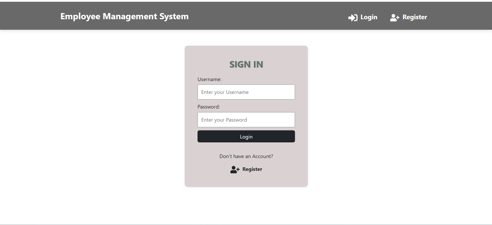
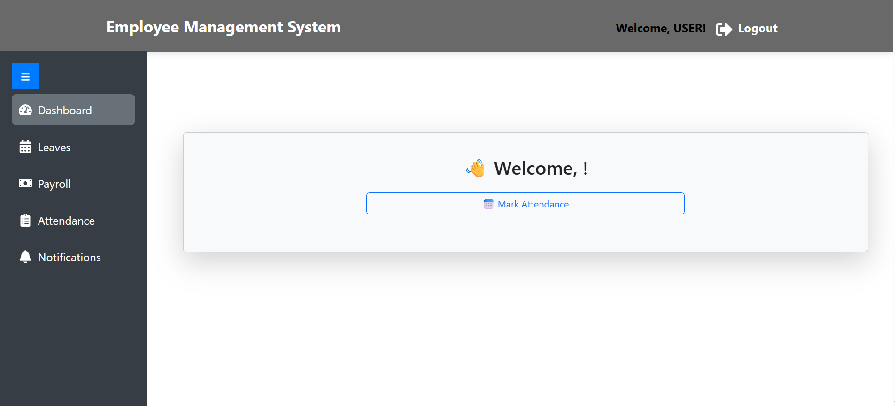
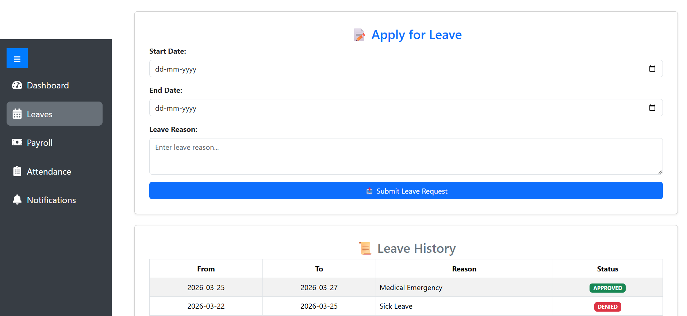
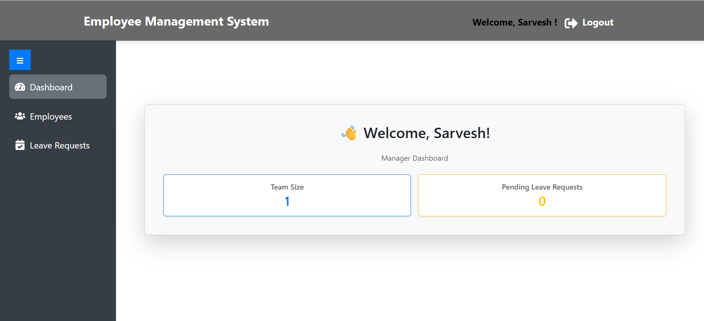

# Employee-management-System

Employee Management System is a full-stack web application that allows users, managers, and administrators to manage employee data efficiently. It features separate User, Manager, and Admin panels with role-based access control, enabling smooth handling of employee operations.

A full-stack Employee Management System built using **React.js** for the frontend, **Spring Boot** for the backend, and **MySQL** as the database. This project allows role-based CRUD operations and workflow management for employees.

## Features

👤 User Panel  
- Mark attendance  
- Apply for leave  
- View payroll information  

👨‍💼 Manager Panel  
- Monitor team members  
- Review and manage leave requests  
- Add and manage new employees  

🛠️ Admin Panel  
- Approve or deny leave requests  
- Perform RESTful operations on employees  
- Manage payroll  
- Full system control  

## Tech Stack

### Frontend
- React.js  
- Axios (for API calls)  
- Bootstrap / TailwindCSS (optional UI styling)  

### Backend
- Spring Boot  
- Spring Data JPA  
- REST API  

### Database
- MySQL  

## Getting Started

### Prerequisites

- Node.js and npm  
- Java JDK 17+ or 11+  
- MySQL  
- Maven  

### Backend Setup

1. Clone the repository.  
2. Import the backend folder in your IDE (e.g., IntelliJ, Eclipse).  
3. Configure `application.properties` with your MySQL credentials:

```properties
spring.datasource.url=jdbc:mysql://localhost:3306/employee_db
spring.datasource.username=root
spring.datasource.password=yourpassword
spring.jpa.hibernate.ddl-auto=update
```md id="fix01"
spring.datasource.url=jdbc:mysql://localhost:3306/employee_db
spring.datasource.username=root
spring.datasource.password=yourpassword
spring.jpa.hibernate.ddl-auto=update

## 📸 Screenshots

### 🔐 **Login Page**


### 👤 **User Home Page**


### 📝 **Leave Management**


### 👨‍💼 **Manager Panel**


### 🛠️ **Admin Panel**

